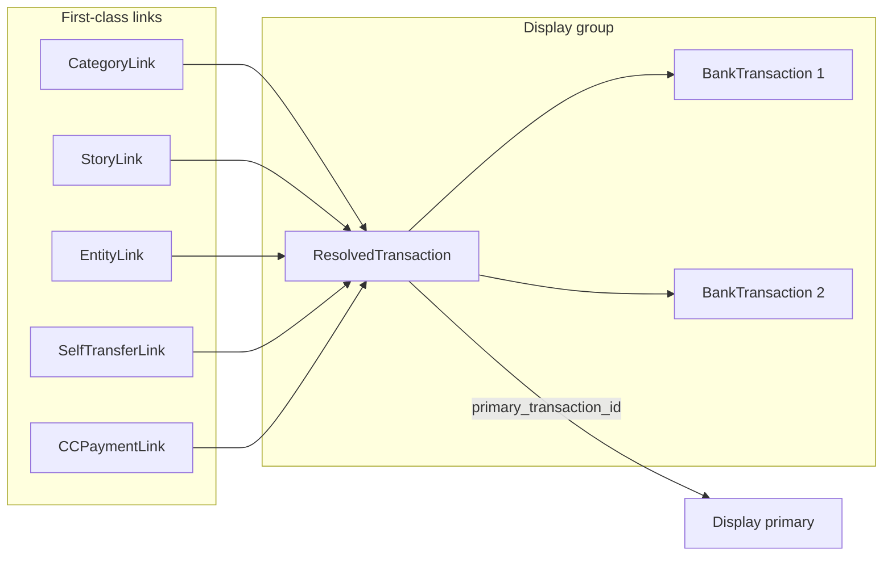

# Durable, Transferable Links

This plan has two parts: **Part 1** makes every transaction belong to a ResolvedTransaction (universal display_group). **Part 2** introduces first-class link objects that attach to ResolvedTransaction with origin/display_primary semantics, full recovery, and no link deletion.

---

# Part 1: Universal ResolvedTransaction

## Current state

- **ResolvedTransaction is only created when:**
  - Executing resolution (overlapping groups) in [extractions/views.py](extractions/views.py) — one per confirmed group.
  - Unlinking a transaction from a group — one new single-member `ResolvedTransaction` for the unlinked txn.
- **Loader** ([extractions/loader.py](extractions/loader.py)) creates `BankTransaction` / `CreditCardTransaction` **without** setting `resolved_transaction`; it stays `null`.
- **Display** ([dashboard/views.py](dashboard/views.py) `get_active_transactions()`) treats two cases:
  - `resolved_transaction__isnull=True` → show the txn (standalone).
  - `is_primary=True` → show the txn (primary of a resolved group).

So only overlapping (and unlinked) transactions have a `ResolvedTransaction`. Standalone transactions have no display_group, so links cannot be uniformly attached to a ResolvedTransaction.

## Streamline: every transaction has a ResolvedTransaction

- **Overlapping case:** Multiple source txns → one `ResolvedTransaction` (existing behavior).
- **Non-overlapping case:** One source txn → one **single-member** `ResolvedTransaction` (new behavior).

Then display_group is always `resolved_transaction` (no nulls), display_primary is always the primary of that ResolvedTransaction, and links can attach only to `ResolvedTransaction`.

### Implementation (Part 1)

1. **Create single-member ResolvedTransaction at load time** — [extractions/loader.py](extractions/loader.py): In `_load_bank_transactions` and `_load_cc_transactions`, after bulk_create of transactions, bulk-create one `ResolvedTransaction` per txn and bulk-update transactions with `resolved_transaction_id` and `is_primary=True`.
2. **Backfill** — New data migration: for every `BankTransaction`/`CreditCardTransaction` with `resolved_transaction` null, create single-member `ResolvedTransaction` and link (batched).
3. **Simplify display** — [dashboard/views.py](dashboard/views.py): Change `get_active_transactions()` from `Q(resolved_transaction__isnull=True) | Q(is_primary=True)` to `Q(is_primary=True)` only. Update any other filters that rely on `resolved_transaction__isnull`.
4. **Optional:** Make `ResolvedTransaction.primary_transaction_id` nullable for zero-member groups after unload.

---

# Part 2: First-Class Durable Links

## Current state vs requirements

**From [docs/MODELLING-REVAMP.md](MODELLING-REVAMP.md):** Post-load data (links, tags) is removed on unload and reapplied on reload. [docs/REPLACE_SOURCE.md](REPLACE_SOURCE.md) keeps linkages on source transactions.

**Current gaps:**

| Area | Current | Gap |
|------|--------|-----|
| Link storage | Category on txn; self-transfer on `BankTransaction.linked_transaction`; stories/entities on `StoryTransaction`/`EntityTransaction`; CC payment on `CreditCardPaymentMatch` (CASCADE) | Links live on txns; deleting/unloading loses or orphans them. No origin or display_group. |
| Display group | ResolvedTransaction groups overlapping txns; primary chosen by `is_primary` | After Part 1, every txn has a ResolvedTransaction; links still don't reference it. |
| Primary deleted | Unlink API promotes another; **unload does not** promote | Links on that txn lost; no recovery. |
| Origin deleted/unloaded | Unload deletes txns, snapshots by artifact+row_id; reapply on reload. Story/entity refs orphan; CC match CASCADE deleted | Links not durable independent of origin. |

**Requirements:** Links as their own objects; track **origin** (txn where created) and **display_group** (all overlapping txns) and **display_primary** (where shown); if primary deleted, links recoverable when another primary selected; if origin deleted/unloaded, links remain; links never deleted (may be "unused" if display_group empty); extra durability measures.

## Architecture

- **display_group** = `ResolvedTransaction` (after Part 1, always set).
- **display_primary** = derived from `ResolvedTransaction.primary_transaction_id` and `is_primary` (not stored on links).
- Links are first-class models that reference **ResolvedTransaction** (and for binary links, a second ResolvedTransaction). No FKs to transactions with CASCADE.
- **Origin** = optional audit fields on each link (`origin_transaction_type`, `origin_transaction_id`). When origin txn is deleted, link remains; origin fields can be nulled.

## New link models

**Placement:** New app `links` or under `extractions`. Common pattern: FK to `ResolvedTransaction` (display_group) with `on_delete=SET_NULL`; optional `origin_transaction_type`, `origin_transaction_id` (int, no FK); no CASCADE to transactions.

1. **CategoryLink** — `resolved_transaction`, `category` (str), `origin_transaction_type`, `origin_transaction_id` (nullable). One effective category per ResolvedTransaction (or latest wins).
2. **StoryLink** — `resolved_transaction`, `story` (FK to Story), `origin_*` (nullable). Replaces StoryTransaction for txn attachment.
3. **EntityLink** — Same as StoryLink for Entity. Replaces EntityTransaction for txn attachment.
4. **SelfTransferLink** — `resolved_transaction_a`, `resolved_transaction_b`, `origin_transaction_id_a`, `origin_transaction_id_b` (nullable). Replaces pair of `BankTransaction.linked_transaction`.
5. **CreditCardPaymentLink** — `bank_resolved_transaction`, `cc_resolved_transaction`, `offset`, `confidence_score`, `match_reasons`, `origin_bank_transaction_id`, `origin_cc_transaction_id` (nullable). Replaces CreditCardPaymentMatch.

**ResolvedTransaction:** Do not delete when last member is removed (current behavior). Optionally allow `primary_transaction_id` null when member count is 0.

## Primary deleted → links recoverable

- **Unload path:** In [extractions/loader.py](extractions/loader.py) `unload_artifact`, before deleting txns: for each ResolvedTransaction whose **primary** is in the set being deleted, **promote another member** (if any) not in that set. Then delete txns. Links stay on ResolvedTransaction and remain displayed on the new primary.
- **Single-txn delete (if any):** Same — if deleted txn was primary, promote another.

## Origin deleted/unloaded → links stay

- Links hold no FKs to transactions; only optional `origin_*` ints. Deleting/unloading a txn does not CASCADE links. Optionally null `origin_*` for clarity.

## Unload / reload and snapshots

- **On unload:** Snapshot link state by (artifact_id, row_id) and resolved_transaction_id(s) and payload (category, story_id, entity_id, etc.). Delete txns (after promote-if-primary). Do **not** delete first-class link rows; they stay on ResolvedTransaction. If a ResolvedTransaction ends with zero members, links can stay attached (unused) or be set to `resolved_transaction_id=NULL` (optional).
- **On reload:** Create new txns and new single-member ResolvedTransactions. For each (artifact, row_id) with snapshotted links, create **new** link rows pointing to the new ResolvedTransaction(s). Old link rows remain (unused). Snapshot can be cleared after reapply or kept for audit.
- **Resolution merge:** When grouping source txns into one ResolvedTransaction, **reassign** links from old ResolvedTransactions to the new one (update `resolved_transaction_id`).

## Durability measures

- Never hard-delete link rows; only mark unused (e.g. `resolved_transaction_id=NULL`, optional `unused_at`).
- Promote on unload (see above).
- Allow ResolvedTransaction with zero members; optional `primary_transaction_id` null when empty.
- Snapshot schema extended to store resolved_transaction_id(s) and payload for reattach on reload.
- Optional: audit table for link (link_id, action, resolved_transaction_id, origin_*, timestamp).

## Migration (Part 2)

- **Category:** Backfill CategoryLink from `BankTransaction`/`CreditCardTransaction`.`category` per ResolvedTransaction; origin = primary. APIs read category from CategoryLink.
- **Stories/Entities:** Migrate StoryTransaction/EntityTransaction to StoryLink/EntityLink by resolving (transaction_type, transaction_id) to ResolvedTransaction. Switch `get_stories()`/`get_entities()` to use link tables.
- **Self-transfer:** Create SelfTransferLink per linked pair of ResolvedTransactions; store origin txns. APIs read from SelfTransferLink.
- **CC payment:** Migrate CreditCardPaymentMatch to CreditCardPaymentLink (resolve both sides to ResolvedTransaction). APIs use new model.
- **TransactionLinkSnapshot:** Extend for new link types and resolved_transaction_id(s); reapply creates new link rows.

## Files to touch (summary)

| Area | Files |
|------|--------|
| Part 1 | [extractions/loader.py](extractions/loader.py), new migration, [dashboard/views.py](dashboard/views.py) |
| Link models | New app `links` or [extractions/models.py](extractions/models.py) |
| Unload / promote | [extractions/loader.py](extractions/loader.py) |
| Snapshots & reapply | [extractions/loader.py](extractions/loader.py), [extractions/models.py](extractions/models.py) |
| Resolution merge | [extractions/views.py](extractions/views.py) |
| APIs read/write | [dashboard/views.py](dashboard/views.py), [extractions/views.py](extractions/views.py), [stories/](stories/), [entities/](entities/), [credit_cards/](credit_cards/) |

## Order of implementation

1. **Part 1:** Universal ResolvedTransaction — loader creates single-member resolved per txn; migration backfills nulls; display uses `is_primary=True` only.
2. **Part 2a:** Add link models (CategoryLink, StoryLink, EntityLink, SelfTransferLink, CreditCardPaymentLink).
3. **Part 2b:** Promote-on-unload in `unload_artifact`; optional read-time fallback when primary is missing.
4. **Part 2c:** Extend snapshot/reapply for new link types and resolved_transaction_id(s); reapply creates new link rows on reload.
5. **Part 2d:** Migrate existing data (category, StoryTransaction, EntityTransaction, linked_transaction, CreditCardPaymentMatch) into link tables.
6. **Part 2e:** Switch all read paths (list/detail, get_stories, get_entities, linked txn, CC match) to link tables.
7. **Part 2f:** Switch all write paths (category, link/unlink, add-to-story/entity, CC match) to create/update link rows.
8. **Part 2g:** On resolution execute, reassign links from old ResolvedTransactions to the new merged one.
9. **Optional:** Mark links unused when ResolvedTransaction has zero members; audit table.

---

## Implementation Status

### Completed

- **Completed group deletion with link preservation:** Deleting a completed overlapping group now unmerges resolved transactions and reroutes all link types (CategoryLink, StoryLink, EntityLink, SelfTransferLink, CreditCardPaymentLink) back to individual transactions. The entire operation is wrapped in `transaction.atomic()` for safety.
- **Recovery management command:** `recover_orphaned_links` command available to recover links whose `resolved_transaction` was set to NULL. Supports `--dry-run` for preview. See [RUNBOOK.md](RUNBOOK.md) for usage.
- **Frontend confirmation guard:** Delete action on completed overlapping groups shows a confirmation dialog before proceeding.
- **JIT ResolvedTransaction in story/entity endpoints:** The story-add and entity-add endpoints now create a single-member `ResolvedTransaction` on the fly if the transaction doesn't have one, ensuring `StoryLink`/`EntityLink` are always created. Old `StoryTransaction`/`EntityTransaction` models are no longer used in views, admin, loader, or tests.
- **Backfill command:** Run `uv run python manage.py backfill_resolved_transactions` to create `ResolvedTransaction` for all existing NULL rows.
